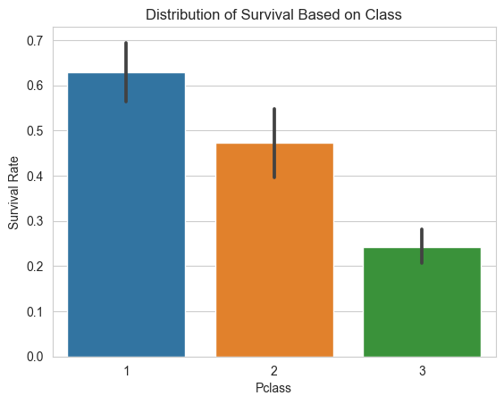

Title: Kaggle Titanic
Date: 2023-03-10 00:27
Category: 4. Casos de Estudio

# Caso de estudio Titanic con Python

(Guia de referencia: https://www.kaggle.com/code/samsonqian/titanic-guide-with-sklearn-and-eda/notebook?scriptVersionId=17744221)

### Paso 1: Importar librerias y paquetes

Con el siguiente bloque de código importaremos todo lo necesario para que nuestro programa funcione

```python
import numpy as np 
import pandas as pd 

import seaborn as sns
from matplotlib import pyplot as plt
sns.set_style("whitegrid")
%matplotlib inline

import warnings
warnings.filterwarnings("ignore")

import os 
print(os.listdir("./input"))
```

    ['gender_submission.csv', 'test.csv', 'train.csv']

### Paso 2: Cargar y ver los Datasets

```python
training = pd.read_csv("./input/train.csv")
testing = pd.read_csv("./input/test.csv")

training.head()


```

<div>
<style scoped>
    .dataframe tbody tr th:only-of-type {
        vertical-align: middle;
    }

    .dataframe tbody tr th {
        vertical-align: top;
    }

    .dataframe thead th {
        text-align: right;
    }`</style>`

<table border="1" class="dataframe">
  <thead>
    <tr style="text-align: right;">
      <th></th>
      <th>PassengerId</th>
      <th>Survived</th>
      <th>Pclass</th>
      <th>Name</th>
      <th>Sex</th>
      <th>Age</th>
      <th>SibSp</th>
      <th>Parch</th>
      <th>Ticket</th>
      <th>Fare</th>
      <th>Cabin</th>
      <th>Embarked</th>
    </tr>
  </thead>
  <tbody>
    <tr>
      <th>0</th>
      <td>1</td>
      <td>0</td>
      <td>3</td>
      <td>Braund, Mr. Owen Harris</td>
      <td>male</td>
      <td>22.0</td>
      <td>1</td>
      <td>0</td>
      <td>A/5 21171</td>
      <td>7.2500</td>
      <td>NaN</td>
      <td>S</td>
    </tr>
    <tr>
      <th>1</th>
      <td>2</td>
      <td>1</td>
      <td>1</td>
      <td>Cumings, Mrs. John Bradley (Florence Briggs Th...</td>
      <td>female</td>
      <td>38.0</td>
      <td>1</td>
      <td>0</td>
      <td>PC 17599</td>
      <td>71.2833</td>
      <td>C85</td>
      <td>C</td>
    </tr>
    <tr>
      <th>2</th>
      <td>3</td>
      <td>1</td>
      <td>3</td>
      <td>Heikkinen, Miss. Laina</td>
      <td>female</td>
      <td>26.0</td>
      <td>0</td>
      <td>0</td>
      <td>STON/O2. 3101282</td>
      <td>7.9250</td>
      <td>NaN</td>
      <td>S</td>
    </tr>
    <tr>
      <th>3</th>
      <td>4</td>
      <td>1</td>
      <td>1</td>
      <td>Futrelle, Mrs. Jacques Heath (Lily May Peel)</td>
      <td>female</td>
      <td>35.0</td>
      <td>1</td>
      <td>0</td>
      <td>113803</td>
      <td>53.1000</td>
      <td>C123</td>
      <td>S</td>
    </tr>
    <tr>
      <th>4</th>
      <td>5</td>
      <td>0</td>
      <td>3</td>
      <td>Allen, Mr. William Henry</td>
      <td>male</td>
      <td>35.0</td>
      <td>0</td>
      <td>0</td>
      <td>373450</td>
      <td>8.0500</td>
      <td>NaN</td>
      <td>S</td>
    </tr>
  </tbody>
</table>
</div>

```python
testing.head()
```

<div>
<style scoped>
    .dataframe tbody tr th:only-of-type {
        vertical-align: middle;
    }

    .dataframe tbody tr th {
        vertical-align: top;
    }

    .dataframe thead th {
        text-align: right;
    }`</style>`

<table border="1" class="dataframe">
  <thead>
    <tr style="text-align: right;">
      <th></th>
      <th>PassengerId</th>
      <th>Pclass</th>
      <th>Name</th>
      <th>Sex</th>
      <th>Age</th>
      <th>SibSp</th>
      <th>Parch</th>
      <th>Ticket</th>
      <th>Fare</th>
      <th>Cabin</th>
      <th>Embarked</th>
    </tr>
  </thead>
  <tbody>
    <tr>
      <th>0</th>
      <td>892</td>
      <td>3</td>
      <td>Kelly, Mr. James</td>
      <td>male</td>
      <td>34.5</td>
      <td>0</td>
      <td>0</td>
      <td>330911</td>
      <td>7.8292</td>
      <td>NaN</td>
      <td>Q</td>
    </tr>
    <tr>
      <th>1</th>
      <td>893</td>
      <td>3</td>
      <td>Wilkes, Mrs. James (Ellen Needs)</td>
      <td>female</td>
      <td>47.0</td>
      <td>1</td>
      <td>0</td>
      <td>363272</td>
      <td>7.0000</td>
      <td>NaN</td>
      <td>S</td>
    </tr>
    <tr>
      <th>2</th>
      <td>894</td>
      <td>2</td>
      <td>Myles, Mr. Thomas Francis</td>
      <td>male</td>
      <td>62.0</td>
      <td>0</td>
      <td>0</td>
      <td>240276</td>
      <td>9.6875</td>
      <td>NaN</td>
      <td>Q</td>
    </tr>
    <tr>
      <th>3</th>
      <td>895</td>
      <td>3</td>
      <td>Wirz, Mr. Albert</td>
      <td>male</td>
      <td>27.0</td>
      <td>0</td>
      <td>0</td>
      <td>315154</td>
      <td>8.6625</td>
      <td>NaN</td>
      <td>S</td>
    </tr>
    <tr>
      <th>4</th>
      <td>896</td>
      <td>3</td>
      <td>Hirvonen, Mrs. Alexander (Helga E Lindqvist)</td>
      <td>female</td>
      <td>22.0</td>
      <td>1</td>
      <td>1</td>
      <td>3101298</td>
      <td>12.2875</td>
      <td>NaN</td>
      <td>S</td>
    </tr>
  </tbody>
</table>
</div>

Estos datos están en un estado malo, es necesario procesarlos.

```python
print(training.keys())
print(testing.keys())
```

    Index(['PassengerId', 'Survived', 'Pclass', 'Name', 'Sex', 'Age', 'SibSp',
           'Parch', 'Ticket', 'Fare', 'Cabin', 'Embarked'],
          dtype='object')
    Index(['PassengerId', 'Pclass', 'Name', 'Sex', 'Age', 'SibSp', 'Parch',
           'Ticket', 'Fare', 'Cabin', 'Embarked'],
          dtype='object')

```python
types_train = training.dtypes
num_values = types_train[(types_train == float)]

print("These are the numerical features:")
print(num_values)
```

    These are the numerical features:
    Age     float64
    Fare    float64
    dtype: object

```python
training.describe()
```

<div>
<style scoped>
    .dataframe tbody tr th:only-of-type {
        vertical-align: middle;
    }

    .dataframe tbody tr th {
        vertical-align: top;
    }

    .dataframe thead th {
        text-align: right;
    }`</style>`

<table border="1" class="dataframe">
  <thead>
    <tr style="text-align: right;">
      <th></th>
      <th>PassengerId</th>
      <th>Survived</th>
      <th>Pclass</th>
      <th>Age</th>
      <th>SibSp</th>
      <th>Parch</th>
      <th>Fare</th>
    </tr>
  </thead>
  <tbody>
    <tr>
      <th>count</th>
      <td>891.000000</td>
      <td>891.000000</td>
      <td>891.000000</td>
      <td>714.000000</td>
      <td>891.000000</td>
      <td>891.000000</td>
      <td>891.000000</td>
    </tr>
    <tr>
      <th>mean</th>
      <td>446.000000</td>
      <td>0.383838</td>
      <td>2.308642</td>
      <td>29.699118</td>
      <td>0.523008</td>
      <td>0.381594</td>
      <td>32.204208</td>
    </tr>
    <tr>
      <th>std</th>
      <td>257.353842</td>
      <td>0.486592</td>
      <td>0.836071</td>
      <td>14.526497</td>
      <td>1.102743</td>
      <td>0.806057</td>
      <td>49.693429</td>
    </tr>
    <tr>
      <th>min</th>
      <td>1.000000</td>
      <td>0.000000</td>
      <td>1.000000</td>
      <td>0.420000</td>
      <td>0.000000</td>
      <td>0.000000</td>
      <td>0.000000</td>
    </tr>
    <tr>
      <th>25%</th>
      <td>223.500000</td>
      <td>0.000000</td>
      <td>2.000000</td>
      <td>20.125000</td>
      <td>0.000000</td>
      <td>0.000000</td>
      <td>7.910400</td>
    </tr>
    <tr>
      <th>50%</th>
      <td>446.000000</td>
      <td>0.000000</td>
      <td>3.000000</td>
      <td>28.000000</td>
      <td>0.000000</td>
      <td>0.000000</td>
      <td>14.454200</td>
    </tr>
    <tr>
      <th>75%</th>
      <td>668.500000</td>
      <td>1.000000</td>
      <td>3.000000</td>
      <td>38.000000</td>
      <td>1.000000</td>
      <td>0.000000</td>
      <td>31.000000</td>
    </tr>
    <tr>
      <th>max</th>
      <td>891.000000</td>
      <td>1.000000</td>
      <td>3.000000</td>
      <td>80.000000</td>
      <td>8.000000</td>
      <td>6.000000</td>
      <td>512.329200</td>
    </tr>
  </tbody>
</table>
</div>

### Parte 3: Lidiando con Valores Faltantes

```python
def null_table(training, testing):
    print("Training Data Frame")
    print(pd.isnull(training).sum()) 
    print(" ")
    print("Testing Data Frame")
    print(pd.isnull(testing).sum())

null_table(training, testing)
```

    Training Data Frame
    PassengerId      0
    Survived         0
    Pclass           0
    Name             0
    Sex              0
    Age            177
    SibSp            0
    Parch            0
    Ticket           0
    Fare             0
    Cabin          687
    Embarked         2
    dtype: int64

    Testing Data Frame
    PassengerId      0
    Pclass           0
    Name             0
    Sex              0
    Age             86
    SibSp            0
    Parch            0
    Ticket           0
    Fare             1
    Cabin          327
    Embarked         0
    dtype: int64

Cabina tiene demasiados datos faltantes como para sernos útil, y ticket parece ser demasiado caótico, por lo tanto descartaremos ambos datos

```python
training.drop(labels = ["Cabin", "Ticket"], axis = 1, inplace = True)
testing.drop(labels = ["Cabin", "Ticket"], axis = 1, inplace = True)

null_table(training, testing)
```

    Training Data Frame
    PassengerId      0
    Survived         0
    Pclass           0
    Name             0
    Sex              0
    Age            177
    SibSp            0
    Parch            0
    Fare             0
    Embarked         2
    dtype: int64

    Testing Data Frame
    PassengerId     0
    Pclass          0
    Name            0
    Sex             0
    Age            86
    SibSp           0
    Parch           0
    Fare            1
    Embarked        0
    dtype: int64

Ahora es necesario ver la distribución de las edades para determinar con que método rellenaremos los datos faltantes.

```python
copy = training.copy()
copy.dropna(inplace = True)
sns.distplot(copy["Age"])
```

    <Axes: xlabel='Age', ylabel='Density'>


Mirando como esta distribución esta un poco torcida hacia la derecha, utilizar la mediana es una opción viable.

```python
training["Age"].fillna(training["Age"].median(), inplace = True)
testing["Age"].fillna(testing["Age"].median(), inplace = True) 
training["Embarked"].fillna("S", inplace = True)
testing["Fare"].fillna(testing["Fare"].median(), inplace = True)

null_table(training, testing)
```

    Training Data Frame
    PassengerId    0
    Survived       0
    Pclass         0
    Name           0
    Sex            0
    Age            0
    SibSp          0
    Parch          0
    Fare           0
    Embarked       0
    dtype: int64

    Testing Data Frame
    PassengerId    0
    Pclass         0
    Name           0
    Sex            0
    Age            0
    SibSp          0
    Parch          0
    Fare           0
    Embarked       0
    dtype: int64

Problema con valores faltantes solucionado!.

### Parte 4: Trazar y visualizar datos

```python
sns.barplot(x="Sex", y="Survived", data=training)
plt.title("Distribution of Survival based on Gender")
plt.show()

total_survived_females = training[training.Sex == "female"]["Survived"].sum()
total_survived_males = training[training.Sex == "male"]["Survived"].sum()

print("Total people survived is: " + str((total_survived_females + total_survived_males)))
print("Proportion of Females who survived:") 
print(total_survived_females/(total_survived_females + total_survived_males))
print("Proportion of Males who survived:")
print(total_survived_males/(total_survived_females + total_survived_males))
```


    Total people survived is: 342
    Proportion of Females who survived:
    0.6812865497076024
    Proportion of Males who survived:
    0.31871345029239767

```python
sns.barplot(x="Pclass", y="Survived", data=training)
plt.ylabel("Survival Rate")
plt.title("Distribution of Survival Based on Class")
plt.show()

total_survived_one = training[training.Pclass == 1]["Survived"].sum()
total_survived_two = training[training.Pclass == 2]["Survived"].sum()
total_survived_three = training[training.Pclass == 3]["Survived"].sum()
total_survived_class = total_survived_one + total_survived_two + total_survived_three

print("Total people survived is: " + str(total_survived_class))
print("Proportion of Class 1 Passengers who survived:") 
print(total_survived_one/total_survived_class)
print("Proportion of Class 2 Passengers who survived:")
print(total_survived_two/total_survived_class)
print("Proportion of Class 3 Passengers who survived:")
print(total_survived_three/total_survived_class)
```



    Total people survived is: 342
    Proportion of Class 1 Passengers who survived:
    0.39766081871345027
    Proportion of Class 2 Passengers who survived:
    0.2543859649122807
    Proportion of Class 3 Passengers who survived:
    0.347953216374269

```python
sns.barplot(x="Pclass", y="Survived", hue="Sex", data=training)
plt.ylabel("Survival Rate")
plt.title("Survival Rates Based on Gender and Class")
```

    Text(0.5, 1.0, 'Survival Rates Based on Gender and Class')


```python
sns.barplot(x="Sex", y="Survived", hue="Pclass", data=training)
plt.ylabel("Survival Rate")
plt.title("Survival Rates Based on Gender and Class")
```

    Text(0.5, 1.0, 'Survival Rates Based on Gender and Class')


```python
survived_ages = training[training.Survived == 1]["Age"]
not_survived_ages = training[training.Survived == 0]["Age"]
plt.subplot(1, 2, 1)
sns.distplot(survived_ages, kde=False)
plt.axis([0, 100, 0, 100])
plt.title("Survived")
plt.ylabel("Proportion")
plt.subplot(1, 2, 2)
sns.distplot(not_survived_ages, kde=False)
plt.axis([0, 100, 0, 100])
plt.title("Didn't Survive")
plt.subplots_adjust(right=1.7)
plt.show()
```


```python
sns.stripplot(x="Survived", y="Age", data=training, jitter=True)
```

    <Axes: xlabel='Survived', ylabel='Age'>


```python
sns.pairplot(training)
```

    <seaborn.axisgrid.PairGrid at 0x184015ed600>


### Parte 5: Feature Engineering

```python
training.sample(5)
```

<div>
<style scoped>
    .dataframe tbody tr th:only-of-type {
        vertical-align: middle;
    }

    .dataframe tbody tr th {
        vertical-align: top;
    }

    .dataframe thead th {
        text-align: right;
    }`</style>`

<table border="1" class="dataframe">
  <thead>
    <tr style="text-align: right;">
      <th></th>
      <th>PassengerId</th>
      <th>Survived</th>
      <th>Pclass</th>
      <th>Name</th>
      <th>Sex</th>
      <th>Age</th>
      <th>SibSp</th>
      <th>Parch</th>
      <th>Fare</th>
      <th>Embarked</th>
    </tr>
  </thead>
  <tbody>
    <tr>
      <th>792</th>
      <td>793</td>
      <td>0</td>
      <td>3</td>
      <td>Sage, Miss. Stella Anna</td>
      <td>female</td>
      <td>28.0</td>
      <td>8</td>
      <td>2</td>
      <td>69.5500</td>
      <td>S</td>
    </tr>
    <tr>
      <th>541</th>
      <td>542</td>
      <td>0</td>
      <td>3</td>
      <td>Andersson, Miss. Ingeborg Constanzia</td>
      <td>female</td>
      <td>9.0</td>
      <td>4</td>
      <td>2</td>
      <td>31.2750</td>
      <td>S</td>
    </tr>
    <tr>
      <th>177</th>
      <td>178</td>
      <td>0</td>
      <td>1</td>
      <td>Isham, Miss. Ann Elizabeth</td>
      <td>female</td>
      <td>50.0</td>
      <td>0</td>
      <td>0</td>
      <td>28.7125</td>
      <td>C</td>
    </tr>
    <tr>
      <th>459</th>
      <td>460</td>
      <td>0</td>
      <td>3</td>
      <td>O'Connor, Mr. Maurice</td>
      <td>male</td>
      <td>28.0</td>
      <td>0</td>
      <td>0</td>
      <td>7.7500</td>
      <td>Q</td>
    </tr>
    <tr>
      <th>238</th>
      <td>239</td>
      <td>0</td>
      <td>2</td>
      <td>Pengelly, Mr. Frederick William</td>
      <td>male</td>
      <td>19.0</td>
      <td>0</td>
      <td>0</td>
      <td>10.5000</td>
      <td>S</td>
    </tr>
  </tbody>
</table>
</div>

```python
testing.sample(5)
```

<div>
<style scoped>
    .dataframe tbody tr th:only-of-type {
        vertical-align: middle;
    }

    .dataframe tbody tr th {
        vertical-align: top;
    }

    .dataframe thead th {
        text-align: right;
    }`</style>`

<table border="1" class="dataframe">
  <thead>
    <tr style="text-align: right;">
      <th></th>
      <th>PassengerId</th>
      <th>Pclass</th>
      <th>Name</th>
      <th>Sex</th>
      <th>Age</th>
      <th>SibSp</th>
      <th>Parch</th>
      <th>Fare</th>
      <th>Embarked</th>
    </tr>
  </thead>
  <tbody>
    <tr>
      <th>207</th>
      <td>1099</td>
      <td>2</td>
      <td>Collett, Mr. Sidney C Stuart</td>
      <td>male</td>
      <td>24.0</td>
      <td>0</td>
      <td>0</td>
      <td>10.500</td>
      <td>S</td>
    </tr>
    <tr>
      <th>32</th>
      <td>924</td>
      <td>3</td>
      <td>Dean, Mrs. Bertram (Eva Georgetta Light)</td>
      <td>female</td>
      <td>33.0</td>
      <td>1</td>
      <td>2</td>
      <td>20.575</td>
      <td>S</td>
    </tr>
    <tr>
      <th>380</th>
      <td>1272</td>
      <td>3</td>
      <td>O'Connor, Mr. Patrick</td>
      <td>male</td>
      <td>27.0</td>
      <td>0</td>
      <td>0</td>
      <td>7.750</td>
      <td>Q</td>
    </tr>
    <tr>
      <th>18</th>
      <td>910</td>
      <td>3</td>
      <td>Ilmakangas, Miss. Ida Livija</td>
      <td>female</td>
      <td>27.0</td>
      <td>1</td>
      <td>0</td>
      <td>7.925</td>
      <td>S</td>
    </tr>
    <tr>
      <th>137</th>
      <td>1029</td>
      <td>2</td>
      <td>Schmidt, Mr. August</td>
      <td>male</td>
      <td>26.0</td>
      <td>0</td>
      <td>0</td>
      <td>13.000</td>
      <td>S</td>
    </tr>
  </tbody>
</table>
</div>

```python
set(training["Embarked"])
```

    {'C', 'Q', 'S'}

```python
from sklearn.preprocessing import LabelEncoder

le_sex = LabelEncoder()
le_sex.fit(training["Sex"])

encoded_sex_training = le_sex.transform(training["Sex"])
training["Sex"] = encoded_sex_training
encoded_sex_testing = le_sex.transform(testing["Sex"])
testing["Sex"] = encoded_sex_testing

le_embarked = LabelEncoder()
le_embarked.fit(training["Embarked"])

encoded_embarked_training = le_embarked.transform(training["Embarked"])
training["Embarked"] = encoded_embarked_training
encoded_embarked_testing = le_embarked.transform(testing["Embarked"])
testing["Embarked"] = encoded_embarked_testing
```

```python
training.sample(5)
```

<div>
<style scoped>
    .dataframe tbody tr th:only-of-type {
        vertical-align: middle;
    }

    .dataframe tbody tr th {
        vertical-align: top;
    }

    .dataframe thead th {
        text-align: right;
    }`</style>`

<table border="1" class="dataframe">
  <thead>
    <tr style="text-align: right;">
      <th></th>
      <th>PassengerId</th>
      <th>Survived</th>
      <th>Pclass</th>
      <th>Name</th>
      <th>Sex</th>
      <th>Age</th>
      <th>SibSp</th>
      <th>Parch</th>
      <th>Fare</th>
      <th>Embarked</th>
    </tr>
  </thead>
  <tbody>
    <tr>
      <th>623</th>
      <td>624</td>
      <td>0</td>
      <td>3</td>
      <td>Hansen, Mr. Henry Damsgaard</td>
      <td>1</td>
      <td>21.0</td>
      <td>0</td>
      <td>0</td>
      <td>7.8542</td>
      <td>2</td>
    </tr>
    <tr>
      <th>711</th>
      <td>712</td>
      <td>0</td>
      <td>1</td>
      <td>Klaber, Mr. Herman</td>
      <td>1</td>
      <td>28.0</td>
      <td>0</td>
      <td>0</td>
      <td>26.5500</td>
      <td>2</td>
    </tr>
    <tr>
      <th>26</th>
      <td>27</td>
      <td>0</td>
      <td>3</td>
      <td>Emir, Mr. Farred Chehab</td>
      <td>1</td>
      <td>28.0</td>
      <td>0</td>
      <td>0</td>
      <td>7.2250</td>
      <td>0</td>
    </tr>
    <tr>
      <th>436</th>
      <td>437</td>
      <td>0</td>
      <td>3</td>
      <td>Ford, Miss. Doolina Margaret "Daisy"</td>
      <td>0</td>
      <td>21.0</td>
      <td>2</td>
      <td>2</td>
      <td>34.3750</td>
      <td>2</td>
    </tr>
    <tr>
      <th>17</th>
      <td>18</td>
      <td>1</td>
      <td>2</td>
      <td>Williams, Mr. Charles Eugene</td>
      <td>1</td>
      <td>28.0</td>
      <td>0</td>
      <td>0</td>
      <td>13.0000</td>
      <td>2</td>
    </tr>
  </tbody>
</table>
</div>

```python
testing.sample(5)
```

<div>
<style scoped>
    .dataframe tbody tr th:only-of-type {
        vertical-align: middle;
    }

    .dataframe tbody tr th {
        vertical-align: top;
    }

    .dataframe thead th {
        text-align: right;
    }`</style>`

<table border="1" class="dataframe">
  <thead>
    <tr style="text-align: right;">
      <th></th>
      <th>PassengerId</th>
      <th>Pclass</th>
      <th>Name</th>
      <th>Sex</th>
      <th>Age</th>
      <th>SibSp</th>
      <th>Parch</th>
      <th>Fare</th>
      <th>Embarked</th>
    </tr>
  </thead>
  <tbody>
    <tr>
      <th>34</th>
      <td>926</td>
      <td>1</td>
      <td>Mock, Mr. Philipp Edmund</td>
      <td>1</td>
      <td>30.0</td>
      <td>1</td>
      <td>0</td>
      <td>57.7500</td>
      <td>0</td>
    </tr>
    <tr>
      <th>386</th>
      <td>1278</td>
      <td>3</td>
      <td>Aronsson, Mr. Ernst Axel Algot</td>
      <td>1</td>
      <td>24.0</td>
      <td>0</td>
      <td>0</td>
      <td>7.7750</td>
      <td>2</td>
    </tr>
    <tr>
      <th>108</th>
      <td>1000</td>
      <td>3</td>
      <td>Willer, Mr. Aaron (Abi Weller")"</td>
      <td>1</td>
      <td>27.0</td>
      <td>0</td>
      <td>0</td>
      <td>8.7125</td>
      <td>2</td>
    </tr>
    <tr>
      <th>323</th>
      <td>1215</td>
      <td>1</td>
      <td>Rowe, Mr. Alfred G</td>
      <td>1</td>
      <td>33.0</td>
      <td>0</td>
      <td>0</td>
      <td>26.5500</td>
      <td>2</td>
    </tr>
    <tr>
      <th>131</th>
      <td>1023</td>
      <td>1</td>
      <td>Gracie, Col. Archibald IV</td>
      <td>1</td>
      <td>53.0</td>
      <td>0</td>
      <td>0</td>
      <td>28.5000</td>
      <td>0</td>
    </tr>
  </tbody>
</table>
</div>

```python
training["FamSize"] = training["SibSp"] + training["Parch"] + 1
testing["FamSize"] = testing["SibSp"] + testing["Parch"] + 1
```

```python
training["IsAlone"] = training.FamSize.apply(lambda x: 1 if x == 1 else 0)
testing["IsAlone"] = testing.FamSize.apply(lambda x: 1 if x == 1 else 0)
```

```python
for name in training["Name"]:
    training["Title"] = training["Name"].str.extract("([A-Za-z]+)\.",expand=True)
  
for name in testing["Name"]:
    testing["Title"] = testing["Name"].str.extract("([A-Za-z]+)\.",expand=True)
```

```python
training.head()
```

<div>
<style scoped>
    .dataframe tbody tr th:only-of-type {
        vertical-align: middle;
    }

    .dataframe tbody tr th {
        vertical-align: top;
    }

    .dataframe thead th {
        text-align: right;
    }`</style>`

<table border="1" class="dataframe">
  <thead>
    <tr style="text-align: right;">
      <th></th>
      <th>PassengerId</th>
      <th>Survived</th>
      <th>Pclass</th>
      <th>Name</th>
      <th>Sex</th>
      <th>Age</th>
      <th>SibSp</th>
      <th>Parch</th>
      <th>Fare</th>
      <th>Embarked</th>
      <th>FamSize</th>
      <th>IsAlone</th>
      <th>Title</th>
    </tr>
  </thead>
  <tbody>
    <tr>
      <th>0</th>
      <td>1</td>
      <td>0</td>
      <td>3</td>
      <td>Braund, Mr. Owen Harris</td>
      <td>1</td>
      <td>22.0</td>
      <td>1</td>
      <td>0</td>
      <td>7.2500</td>
      <td>2</td>
      <td>2</td>
      <td>0</td>
      <td>Mr</td>
    </tr>
    <tr>
      <th>1</th>
      <td>2</td>
      <td>1</td>
      <td>1</td>
      <td>Cumings, Mrs. John Bradley (Florence Briggs Th...</td>
      <td>0</td>
      <td>38.0</td>
      <td>1</td>
      <td>0</td>
      <td>71.2833</td>
      <td>0</td>
      <td>2</td>
      <td>0</td>
      <td>Mrs</td>
    </tr>
    <tr>
      <th>2</th>
      <td>3</td>
      <td>1</td>
      <td>3</td>
      <td>Heikkinen, Miss. Laina</td>
      <td>0</td>
      <td>26.0</td>
      <td>0</td>
      <td>0</td>
      <td>7.9250</td>
      <td>2</td>
      <td>1</td>
      <td>1</td>
      <td>Miss</td>
    </tr>
    <tr>
      <th>3</th>
      <td>4</td>
      <td>1</td>
      <td>1</td>
      <td>Futrelle, Mrs. Jacques Heath (Lily May Peel)</td>
      <td>0</td>
      <td>35.0</td>
      <td>1</td>
      <td>0</td>
      <td>53.1000</td>
      <td>2</td>
      <td>2</td>
      <td>0</td>
      <td>Mrs</td>
    </tr>
    <tr>
      <th>4</th>
      <td>5</td>
      <td>0</td>
      <td>3</td>
      <td>Allen, Mr. William Henry</td>
      <td>1</td>
      <td>35.0</td>
      <td>0</td>
      <td>0</td>
      <td>8.0500</td>
      <td>2</td>
      <td>1</td>
      <td>1</td>
      <td>Mr</td>
    </tr>
  </tbody>
</table>
</div>

```python
titles = set(training["Title"])
print(titles)
```

    {'Mr', 'Rev', 'Ms', 'Mlle', 'Col', 'Capt', 'Lady', 'Don', 'Countess', 'Jonkheer', 'Master', 'Dr', 'Sir', 'Mme', 'Mrs', 'Miss', 'Major'}

```python
title_list = list(training["Title"])
frequency_titles = []

for i in titles:
    frequency_titles.append(title_list.count(i))
  
print(frequency_titles)
```

    [517, 6, 1, 2, 2, 1, 1, 1, 1, 1, 40, 7, 1, 1, 125, 182, 2]

```python
titles = list(titles)

title_dataframe = pd.DataFrame({
    "Titles" : titles,
    "Frequency" : frequency_titles
})

print(title_dataframe)
```

    Titles  Frequency
    0         Mr        517
    1        Rev          6
    2         Ms          1
    3       Mlle          2
    4        Col          2
    5       Capt          1
    6       Lady          1
    7        Don          1
    8   Countess          1
    9   Jonkheer          1
    10    Master         40
    11        Dr          7
    12       Sir          1
    13       Mme          1
    14       Mrs        125
    15      Miss        182
    16     Major          2

```python
title_replacements = {"Mlle": "Other", "Major": "Other", "Col": "Other", "Sir": "Other", "Don": "Other", "Mme": "Other",
          "Jonkheer": "Other", "Lady": "Other", "Capt": "Other", "Countess": "Other", "Ms": "Other", "Dona": "Other"}

training.replace({"Title": title_replacements}, inplace=True)
testing.replace({"Title": title_replacements}, inplace=True)

le_title = LabelEncoder()
le_title.fit(training["Title"])

encoded_title_training = le_title.transform(training["Title"])
training["Title"] = encoded_title_training
encoded_title_testing = le_title.transform(testing["Title"])
testing["Title"] = encoded_title_testing
```

```python
training.drop("Name", axis = 1, inplace = True)
testing.drop("Name", axis = 1, inplace = True)
```

```python
testing.sample(5)
```

<div>
<style scoped>
    .dataframe tbody tr th:only-of-type {
        vertical-align: middle;
    }

    .dataframe tbody tr th {
        vertical-align: top;
    }

    .dataframe thead th {
        text-align: right;
    }`</style>`

<table border="1" class="dataframe">
  <thead>
    <tr style="text-align: right;">
      <th></th>
      <th>PassengerId</th>
      <th>Pclass</th>
      <th>Sex</th>
      <th>Age</th>
      <th>SibSp</th>
      <th>Parch</th>
      <th>Fare</th>
      <th>Embarked</th>
      <th>FamSize</th>
      <th>IsAlone</th>
      <th>Title</th>
    </tr>
  </thead>
  <tbody>
    <tr>
      <th>178</th>
      <td>1070</td>
      <td>2</td>
      <td>0</td>
      <td>36.0</td>
      <td>0</td>
      <td>3</td>
      <td>39.0000</td>
      <td>2</td>
      <td>4</td>
      <td>0</td>
      <td>4</td>
    </tr>
    <tr>
      <th>337</th>
      <td>1229</td>
      <td>3</td>
      <td>1</td>
      <td>39.0</td>
      <td>0</td>
      <td>2</td>
      <td>7.2292</td>
      <td>0</td>
      <td>3</td>
      <td>0</td>
      <td>3</td>
    </tr>
    <tr>
      <th>181</th>
      <td>1073</td>
      <td>1</td>
      <td>1</td>
      <td>37.0</td>
      <td>1</td>
      <td>1</td>
      <td>83.1583</td>
      <td>0</td>
      <td>3</td>
      <td>0</td>
      <td>3</td>
    </tr>
    <tr>
      <th>109</th>
      <td>1001</td>
      <td>2</td>
      <td>1</td>
      <td>18.5</td>
      <td>0</td>
      <td>0</td>
      <td>13.0000</td>
      <td>2</td>
      <td>1</td>
      <td>1</td>
      <td>3</td>
    </tr>
    <tr>
      <th>352</th>
      <td>1244</td>
      <td>2</td>
      <td>1</td>
      <td>18.0</td>
      <td>0</td>
      <td>0</td>
      <td>73.5000</td>
      <td>2</td>
      <td>1</td>
      <td>1</td>
      <td>3</td>
    </tr>
  </tbody>
</table>
</div>

### Parte 6: Feature Rescaling

```python
from sklearn.preprocessing import StandardScaler

scaler = StandardScaler()


ages_train = np.array(training["Age"]).reshape(-1, 1)
fares_train = np.array(training["Fare"]).reshape(-1, 1)
ages_test = np.array(testing["Age"]).reshape(-1, 1)
fares_test = np.array(testing["Fare"]).reshape(-1, 1)

training["Age"] = scaler.fit_transform(ages_train)
training["Fare"] = scaler.fit_transform(fares_train)
testing["Age"] = scaler.fit_transform(ages_test)
testing["Fare"] = scaler.fit_transform(fares_test)
```

```python
training.head()
```

<div>
<style scoped>
    .dataframe tbody tr th:only-of-type {
        vertical-align: middle;
    }

    .dataframe tbody tr th {
        vertical-align: top;
    }

    .dataframe thead th {
        text-align: right;
    }`</style>`

<table border="1" class="dataframe">
  <thead>
    <tr style="text-align: right;">
      <th></th>
      <th>PassengerId</th>
      <th>Survived</th>
      <th>Pclass</th>
      <th>Sex</th>
      <th>Age</th>
      <th>SibSp</th>
      <th>Parch</th>
      <th>Fare</th>
      <th>Embarked</th>
      <th>FamSize</th>
      <th>IsAlone</th>
      <th>Title</th>
    </tr>
  </thead>
  <tbody>
    <tr>
      <th>0</th>
      <td>1</td>
      <td>0</td>
      <td>3</td>
      <td>1</td>
      <td>-0.565736</td>
      <td>1</td>
      <td>0</td>
      <td>-0.502445</td>
      <td>2</td>
      <td>2</td>
      <td>0</td>
      <td>3</td>
    </tr>
    <tr>
      <th>1</th>
      <td>2</td>
      <td>1</td>
      <td>1</td>
      <td>0</td>
      <td>0.663861</td>
      <td>1</td>
      <td>0</td>
      <td>0.786845</td>
      <td>0</td>
      <td>2</td>
      <td>0</td>
      <td>4</td>
    </tr>
    <tr>
      <th>2</th>
      <td>3</td>
      <td>1</td>
      <td>3</td>
      <td>0</td>
      <td>-0.258337</td>
      <td>0</td>
      <td>0</td>
      <td>-0.488854</td>
      <td>2</td>
      <td>1</td>
      <td>1</td>
      <td>2</td>
    </tr>
    <tr>
      <th>3</th>
      <td>4</td>
      <td>1</td>
      <td>1</td>
      <td>0</td>
      <td>0.433312</td>
      <td>1</td>
      <td>0</td>
      <td>0.420730</td>
      <td>2</td>
      <td>2</td>
      <td>0</td>
      <td>4</td>
    </tr>
    <tr>
      <th>4</th>
      <td>5</td>
      <td>0</td>
      <td>3</td>
      <td>1</td>
      <td>0.433312</td>
      <td>0</td>
      <td>0</td>
      <td>-0.486337</td>
      <td>2</td>
      <td>1</td>
      <td>1</td>
      <td>3</td>
    </tr>
  </tbody>
</table>
</div>

```python
testing.head()
```

<div>
<style scoped>
    .dataframe tbody tr th:only-of-type {
        vertical-align: middle;
    }

    .dataframe tbody tr th {
        vertical-align: top;
    }

    .dataframe thead th {
        text-align: right;
    }`</style>`

<table border="1" class="dataframe">
  <thead>
    <tr style="text-align: right;">
      <th></th>
      <th>PassengerId</th>
      <th>Pclass</th>
      <th>Sex</th>
      <th>Age</th>
      <th>SibSp</th>
      <th>Parch</th>
      <th>Fare</th>
      <th>Embarked</th>
      <th>FamSize</th>
      <th>IsAlone</th>
      <th>Title</th>
    </tr>
  </thead>
  <tbody>
    <tr>
      <th>0</th>
      <td>892</td>
      <td>3</td>
      <td>1</td>
      <td>0.386231</td>
      <td>0</td>
      <td>0</td>
      <td>-0.497413</td>
      <td>1</td>
      <td>1</td>
      <td>1</td>
      <td>3</td>
    </tr>
    <tr>
      <th>1</th>
      <td>893</td>
      <td>3</td>
      <td>0</td>
      <td>1.371370</td>
      <td>1</td>
      <td>0</td>
      <td>-0.512278</td>
      <td>2</td>
      <td>2</td>
      <td>0</td>
      <td>4</td>
    </tr>
    <tr>
      <th>2</th>
      <td>894</td>
      <td>2</td>
      <td>1</td>
      <td>2.553537</td>
      <td>0</td>
      <td>0</td>
      <td>-0.464100</td>
      <td>1</td>
      <td>1</td>
      <td>1</td>
      <td>3</td>
    </tr>
    <tr>
      <th>3</th>
      <td>895</td>
      <td>3</td>
      <td>1</td>
      <td>-0.204852</td>
      <td>0</td>
      <td>0</td>
      <td>-0.482475</td>
      <td>2</td>
      <td>1</td>
      <td>1</td>
      <td>3</td>
    </tr>
    <tr>
      <th>4</th>
      <td>896</td>
      <td>3</td>
      <td>0</td>
      <td>-0.598908</td>
      <td>1</td>
      <td>1</td>
      <td>-0.417492</td>
      <td>2</td>
      <td>3</td>
      <td>0</td>
      <td>4</td>
    </tr>
  </tbody>
</table>
</div>

### Parte 7: Model Fitting, Optimizing, and Predicting

```python
from sklearn.svm import SVC, LinearSVC
from sklearn.ensemble import RandomForestClassifier
from sklearn.linear_model import LogisticRegression
from sklearn.neighbors import KNeighborsClassifier
from sklearn.naive_bayes import GaussianNB
from sklearn.tree import DecisionTreeClassifier
from sklearn.metrics import make_scorer, accuracy_score 
from sklearn.model_selection import GridSearchCV
```

```python
X_train = training.drop(labels=["PassengerId", "Survived"], axis=1) 
y_train = training["Survived"] 
X_test = testing.drop("PassengerId", axis=1) 
```

```python
X_train.head()
```

<div>
<style scoped>
    .dataframe tbody tr th:only-of-type {
        vertical-align: middle;
    }

    .dataframe tbody tr th {
        vertical-align: top;
    }

    .dataframe thead th {
        text-align: right;
    }`</style>`

<table border="1" class="dataframe">
  <thead>
    <tr style="text-align: right;">
      <th></th>
      <th>Pclass</th>
      <th>Sex</th>
      <th>Age</th>
      <th>SibSp</th>
      <th>Parch</th>
      <th>Fare</th>
      <th>Embarked</th>
      <th>FamSize</th>
      <th>IsAlone</th>
      <th>Title</th>
    </tr>
  </thead>
  <tbody>
    <tr>
      <th>0</th>
      <td>3</td>
      <td>1</td>
      <td>-0.565736</td>
      <td>1</td>
      <td>0</td>
      <td>-0.502445</td>
      <td>2</td>
      <td>2</td>
      <td>0</td>
      <td>3</td>
    </tr>
    <tr>
      <th>1</th>
      <td>1</td>
      <td>0</td>
      <td>0.663861</td>
      <td>1</td>
      <td>0</td>
      <td>0.786845</td>
      <td>0</td>
      <td>2</td>
      <td>0</td>
      <td>4</td>
    </tr>
    <tr>
      <th>2</th>
      <td>3</td>
      <td>0</td>
      <td>-0.258337</td>
      <td>0</td>
      <td>0</td>
      <td>-0.488854</td>
      <td>2</td>
      <td>1</td>
      <td>1</td>
      <td>2</td>
    </tr>
    <tr>
      <th>3</th>
      <td>1</td>
      <td>0</td>
      <td>0.433312</td>
      <td>1</td>
      <td>0</td>
      <td>0.420730</td>
      <td>2</td>
      <td>2</td>
      <td>0</td>
      <td>4</td>
    </tr>
    <tr>
      <th>4</th>
      <td>3</td>
      <td>1</td>
      <td>0.433312</td>
      <td>0</td>
      <td>0</td>
      <td>-0.486337</td>
      <td>2</td>
      <td>1</td>
      <td>1</td>
      <td>3</td>
    </tr>
  </tbody>
</table>
</div>

```python
from sklearn.model_selection import train_test_split 
X_training, X_valid, y_training, y_valid = train_test_split(X_train, y_train, test_size=0.2, random_state=0) 
```

```python
svc_clf = SVC() 

parameters_svc = {"kernel": ["rbf", "linear"], "probability": [True, False], "verbose": [True, False]}

grid_svc = GridSearchCV(svc_clf, parameters_svc, scoring=make_scorer(accuracy_score))
grid_svc.fit(X_training, y_training)

svc_clf = grid_svc.best_estimator_

svc_clf.fit(X_training, y_training)
pred_svc = svc_clf.predict(X_valid)
acc_svc = accuracy_score(y_valid, pred_svc)

```

    [LibSVM][LibSVM][LibSVM][LibSVM][LibSVM][LibSVM][LibSVM][LibSVM][LibSVM][LibSVM][LibSVM][LibSVM][LibSVM][LibSVM][LibSVM][LibSVM][LibSVM][LibSVM][LibSVM][LibSVM][LibSVM][LibSVM]

```python
print("The Score for SVC is: " + str(acc_svc))
```

    The Score for SVC is: 0.8212290502793296

```python
linsvc_clf = LinearSVC()

parameters_linsvc = {"multi_class": ["ovr", "crammer_singer"], "fit_intercept": [True, False], "max_iter": [100, 500, 1000, 1500]}

grid_linsvc = GridSearchCV(linsvc_clf, parameters_linsvc, scoring=make_scorer(accuracy_score))
grid_linsvc.fit(X_training, y_training)

linsvc_clf = grid_linsvc.best_estimator_

linsvc_clf.fit(X_training, y_training)
pred_linsvc = linsvc_clf.predict(X_valid)
acc_linsvc = accuracy_score(y_valid, pred_linsvc)

print("The Score for LinearSVC is: " + str(acc_linsvc))

```

    The Score for LinearSVC is: 0.7932960893854749

```python
rf_clf = RandomForestClassifier()

parameters_rf = {"n_estimators": [4, 5, 6, 7, 8, 9, 10, 15], "criterion": ["gini", "entropy"], "max_features": ["auto", "sqrt", "log2"], 
                 "max_depth": [2, 3, 5, 10], "min_samples_split": [2, 3, 5, 10]}

grid_rf = GridSearchCV(rf_clf, parameters_rf, scoring=make_scorer(accuracy_score))
grid_rf.fit(X_training, y_training)

rf_clf = grid_rf.best_estimator_

rf_clf.fit(X_training, y_training)
pred_rf = rf_clf.predict(X_valid)
acc_rf = accuracy_score(y_valid, pred_rf)

print("The Score for Random Forest is: " + str(acc_rf))
```

    The Score for Random Forest is: 0.8435754189944135

```python
logreg_clf = LogisticRegression()

parameters_logreg = {"penalty": ["l2"], "fit_intercept": [True, False], "solver": ["newton-cg", "lbfgs", "liblinear", "sag", "saga"],
                     "max_iter": [50, 100, 200], "warm_start": [True, False]}

grid_logreg = GridSearchCV(logreg_clf, parameters_logreg, scoring=make_scorer(accuracy_score))
grid_logreg.fit(X_training, y_training)

logreg_clf = grid_logreg.best_estimator_

logreg_clf.fit(X_training, y_training)
pred_logreg = logreg_clf.predict(X_valid)
acc_logreg = accuracy_score(y_valid, pred_logreg)

print("The Score for Logistic Regression is: " + str(acc_logreg))
```

    The Score for Logistic Regression is: 0.8100558659217877

```python
knn_clf = KNeighborsClassifier()

parameters_knn = {"n_neighbors": [3, 5, 10, 15], "weights": ["uniform", "distance"], "algorithm": ["auto", "ball_tree", "kd_tree"],
                  "leaf_size": [20, 30, 50]}

grid_knn = GridSearchCV(knn_clf, parameters_knn, scoring=make_scorer(accuracy_score))
grid_knn.fit(X_training, y_training)

knn_clf = grid_knn.best_estimator_

knn_clf.fit(X_training, y_training)
pred_knn = knn_clf.predict(X_valid)
acc_knn = accuracy_score(y_valid, pred_knn)

print("The Score for KNeighbors is: " + str(acc_knn))
```

    The Score for KNeighbors is: 0.7653631284916201

```python
gnb_clf = GaussianNB()

parameters_gnb = {}

grid_gnb = GridSearchCV(gnb_clf, parameters_gnb, scoring=make_scorer(accuracy_score))
grid_gnb.fit(X_training, y_training)

gnb_clf = grid_gnb.best_estimator_

gnb_clf.fit(X_training, y_training)
pred_gnb = gnb_clf.predict(X_valid)
acc_gnb = accuracy_score(y_valid, pred_gnb)

print("The Score for Gaussian NB is: " + str(acc_gnb))
```

    The Score for Gaussian NB is: 0.776536312849162

```python
dt_clf = DecisionTreeClassifier()

parameters_dt = {"criterion": ["gini", "entropy"], "splitter": ["best", "random"], "max_features": ["auto", "sqrt", "log2"]}

grid_dt = GridSearchCV(dt_clf, parameters_dt, scoring=make_scorer(accuracy_score))
grid_dt.fit(X_training, y_training)

dt_clf = grid_dt.best_estimator_

dt_clf.fit(X_training, y_training)
pred_dt = dt_clf.predict(X_valid)
acc_dt = accuracy_score(y_valid, pred_dt)

print("The Score for Decision Tree is: " + str(acc_dt))
```

    The Score for Decision Tree is: 0.8100558659217877

### Parte 8: Evaluación de los Modelos.

```python
model_performance = pd.DataFrame({
    "Model": ["SVC", "Linear SVC", "Random Forest", 
              "Logistic Regression", "K Nearest Neighbors", "Gaussian Naive Bayes",  
              "Decision Tree"],
    "Accuracy": [acc_svc, acc_linsvc, acc_rf, 
              acc_logreg, acc_knn, acc_gnb, acc_dt]
})

model_performance.sort_values(by="Accuracy", ascending=False)
```

<div>
<style scoped>
    .dataframe tbody tr th:only-of-type {
        vertical-align: middle;
    }

    .dataframe tbody tr th {
        vertical-align: top;
    }

    .dataframe thead th {
        text-align: right;
    }`</style>`

<table border="1" class="dataframe">
  <thead>
    <tr style="text-align: right;">
      <th></th>
      <th>Model</th>
      <th>Accuracy</th>
    </tr>
  </thead>
  <tbody>
    <tr>
      <th>2</th>
      <td>Random Forest</td>
      <td>0.843575</td>
    </tr>
    <tr>
      <th>0</th>
      <td>SVC</td>
      <td>0.821229</td>
    </tr>
    <tr>
      <th>3</th>
      <td>Logistic Regression</td>
      <td>0.810056</td>
    </tr>
    <tr>
      <th>6</th>
      <td>Decision Tree</td>
      <td>0.810056</td>
    </tr>
    <tr>
      <th>1</th>
      <td>Linear SVC</td>
      <td>0.793296</td>
    </tr>
    <tr>
      <th>5</th>
      <td>Gaussian Naive Bayes</td>
      <td>0.776536</td>
    </tr>
    <tr>
      <th>4</th>
      <td>K Nearest Neighbors</td>
      <td>0.765363</td>
    </tr>
  </tbody>
</table>
</div>
